# 1701QCA Making Interaction - Assessment 2 workbook

You will use this workbook to keep track of your progress through the course and also as a process journal to document the making of your projects. The comments in italics throughout the template give suggestions about what to include. Feel free to delete those instructions when you have completed the sections.

When you have completed the template, submit the link to the GitHub Pages site for this repository as a link in Learning@Griffith. The link should be something like [https://qcainteractivemedia.github.io/1701QCA-Assessment2/](https://qcainteractivemedia.github.io/1701QCA-Assessment2/) where `qcainteractivemedia` is replaced with your GitHub username and `1701QCA-Assessment2` is replaced with whatever you called the repository this template is contained in when you set it up.

## Project working title ##
The Arcade Lightinator

## Related projects ##
*Find about 6 related projects to the project you choose. A project might be related through  function, technology, materials, fabrication, concept, or code. Don't forget to place an image of the related project in the appropriate folder and insert the filename in the appropriate places below. Copy the markdown block of code below for each project you are showing.*

### Related project 1 ###
*Get Started With Zip Halo for the BBC Microbit*

*https://www.kitronik.co.uk/blog/get-started-with-zip-halo/*

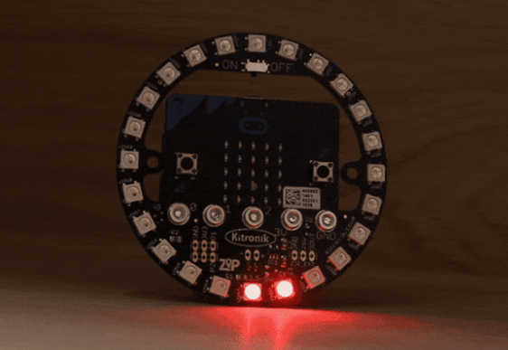

This project is related to mine because it explains how to use the halo with the BBC micro bit and explains the code used to make it work.

### Related project 2 ###
*Creating a compass*

*https://www.element14.com/community/community/stem-academy/microbit/blog/2019/05/15/6-lesson-plans-for-zip-halo-for-bbc-microbit

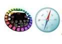

This project is related to mine because it shows how to use the functions of the microbit itself to influence the halo lights.

### Related project 3 ###
*Kitronik ZIP Halo Coaster*

*https://www.digikey.com.au/en/maker/projects/kitronik-zip-halo-coasters-using-microbit/09d20d98e9d9484aa3625060a06e166d*

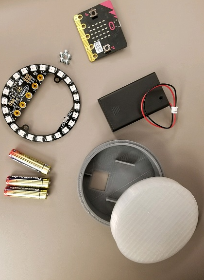

This project is related to mine because it further explains the physical dimensions and use of the halo, as well as explaining the code used to further take advantage of the use cases of the halo.

### Related project 4 ###
*Rainbow - Variable Speed (using 24 halo led from Kitronik)*

*https://makecode.microbit.org/v0/73871-88095-41756-70480*

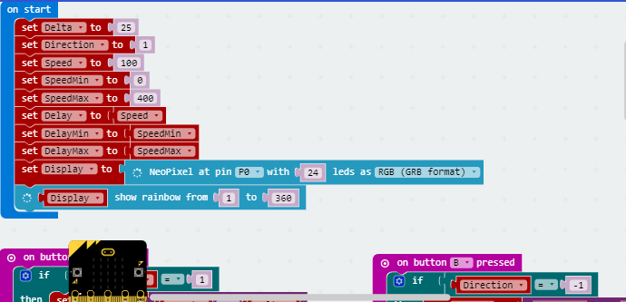

This project is related to mine because it shows the specific code used to make the halo display a variable speed light, which is incredibly important to mine.

### Related project 5 ###
*Kitronik ZIP Halo for the BBC micro:bit - MicroPython Examples*

*https://smalldevices.com.au/blogs/resources/kitronik-zip-halo-for-the-bbc-micro-bit-micropython-examples*

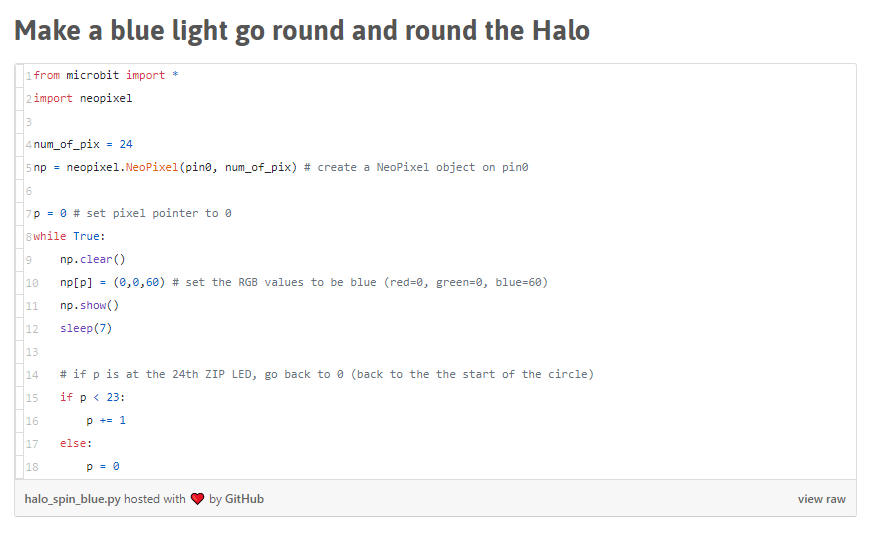

This project is related to mine because it shows the code needed to make a light go around the halo, which is step 1 for my build.

### Related project 6 ###
*Coding A Game*

*https://www.element14.com/community/community/stem-academy/microbit/blog/2019/05/15/6-lesson-plans-for-zip-halo-for-bbc-microbit*

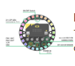

This project is related to mine because it shows how to code and create your own game with the microbit and halo together.

## Other research ##
*Include here any other relevant research you have done. This might include identifying readings, tutorials, videos, technical documents, or other resources that have been helpful. For each particular source, add a comment or two about why it is relevant or what you have taken from it.*

### *Brief resource name/description* ###

*Provide a link, reference, or whatever is required for somebody else to find the resource. Then provide a few comments about what you have drawn from the resource.*

## Conceptual progress ##

### Design intent ###

Objects that enhance the users ability to remain focused.

### Design concept 1 ###

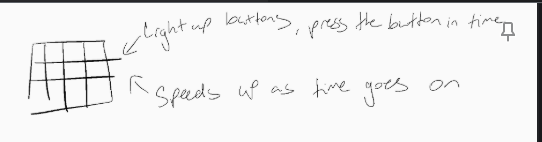

My first design concept was an array of buttons that light up randomly, in the style of 'whack-a-mole' where the intent is to press them when they light up. The individual would have three misses, if they miss three lights then the vibration motors in the body would buzz, and the lights would flash red, indicating that the player has lost. Personally, I like this idea, as I'm a very visual person when it comes to design and in particular my design intent, however, the feasability of buying this many light up buttons means that I'm unable to do this project as it currently stands. 

Which brings us to:

### Design concept 2 ###

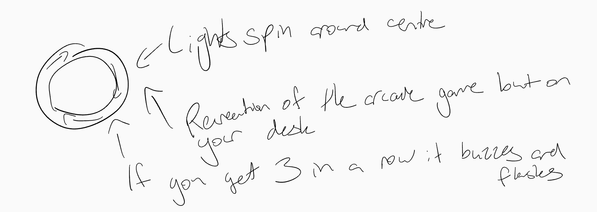

My second design concept is using the microbit 'halo', it's an iteration of the classic arcade game 'cyclone'. A single light spins around the centre at random speeds, and the objective is to catch the light as it goes past the button. Similar to the prior concept, the individual would have three misses, if they miss three lights then the vibration motors in the body would buzz, and the lights would flash red, indicating that the player has lost. I like this idea, however after speaking to David about it, we found a more interesting way to make this project come to life in terms of its interaction.

Which brings us to the final design concept:

### Final design concept ###

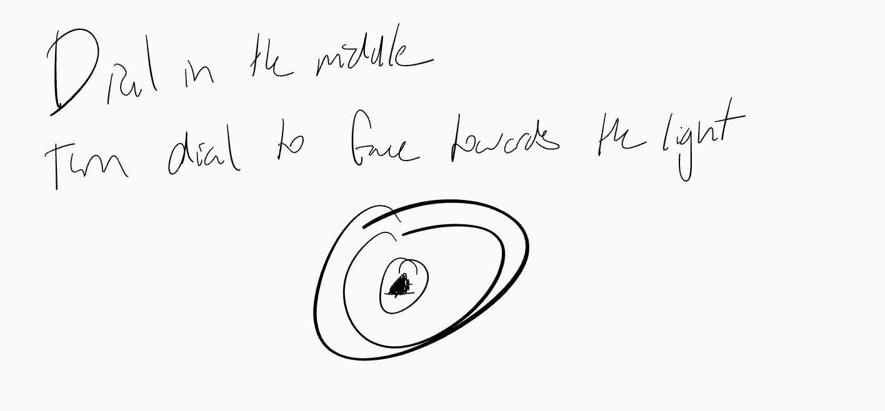

My final design concept is a different version of the classic cyclone machine, where now instead of trying to 'catch' the light with the button, the light will occasionally stop, and at this time the user will need to turn a dial to face the light. Same as the prior two designs, the individual would have three misses, if they miss three lights then the vibration motors in the body would buzz, and the lights would flash red, indicating that the player has lost.

The product will be made of wood, with a clear acrylic plate over the lights so the user can see them. My desk at home is made of wood, hence the use of wood in the creation of this product. I have a woodworking shed at my house, so the shell of the product will be made there.

### Interaction flowchart ###

## Physical experimentation documentation ##

Due to the shipping limitations that COVID-19 presents, I do not have the required materials (Halo, motors etc.) to begin physical hardware testing and fabrication. Therefore, I've been working on the code instead.

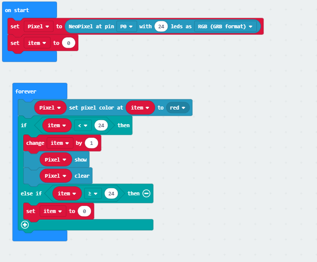

Currently this is where I'm at with my code, I've set the variable Pixel to the input of the Halo and managed to get the light to 'spin' on the test area on the left. Which you can see below:

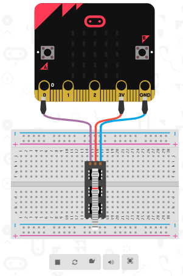

I'm currently in the process of figuring out two things, one, I need to find a way to make the light stop at random intervals. I've managed to get it to stop consistently by using the pause function, however this causes the game to have a pattern, which is against the initial point of the device in the first place. I'm currently experimenting with the 'pick random' function, however am not far enough in my research to show any working code with that in place.

Two, I'm also trying to work out how to put a dial in the centre of my device. I want to use the dial that we used in tutorials in week 3 of tutes, however I'm struggling to remember what it was called so can't find it online anywhere. I'll have to ask David about this and get information from him in regards to its name and where I may be able to purchase one.

This is where I'm at with my code, I can get the light to spin around the Halo, but can't get it to stop randomly OR find a way to get a dial working as of yet. However, I'm sure with further research I'll be able to get there.

As for my fabrication, as previously stated, due to the limitations of Covid-19 I've been unable to receive any of the electronics I've purchased. However, I have drawn up figures of how I imagine my final product looking, which I have attached below:

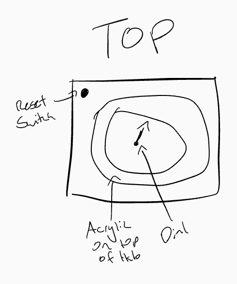

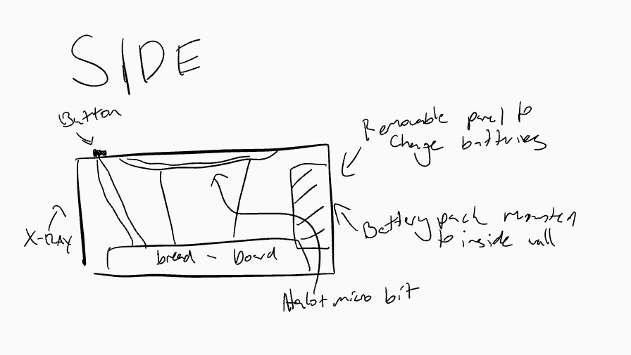

After careful consideration, I've made the decision to make the final product out of wood. This decision was made, mostly because it's what I have available to me. However, it's also an aesthetic decision, due to the fact that my desk is made of wood! Which means that an object also made of wood would fit right in.

## Design process discussion ##

I've found the design process rather difficult actually, this comes from the fact that I'm the kind of person with ideas that are far too large for the practicality of what I can actually accomplish. So having to bring my ideas down and simplify them has been a difficult process for me.

However, in terms of the idea itself, it's one that I've had for quite some time. So it came rather easily in that sense. It was the simplifying it and bringing it down to size that I found rather difficult. 

In designing the product itself, I personally like the boxier, rustic aesthetic a lot. So I found that I could combine the two aesthetics of light up, electronics with the rustic exterior of a wooden box, and I really like that idea! It reminds me a lot of the useless switch boxes that turns themselves off when you turn them on.

Either way, I'm very excited to continue work on this project.

## Next steps ##

1. Finalise code, add random stop functions and dial support
2. Begin Fabrication Process
3. Finalise the electronics + load code to the microbit
4. Finalise my fabrication
5. Put it all together
6. Finish GitHub repository + film video of product in action

